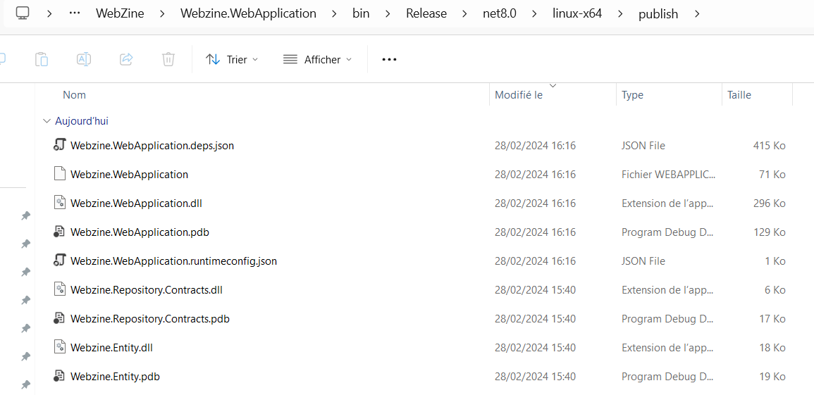

# Documentation de Configuration du Webzine
 
# **1. Introduction** ##

Dans ce manuel, vous découvrirez les directives indispensables pour paramétrer l'application webzine. 

Il est impératif de respecter scrupuleusement ces instructions afin d'assurer une performance optimale de l'application.
 
## **1.1. Configuration de l'application**

### 1.1.1. Lancement avec Windows 

Pour lancer l'application sur Windows, la commande ci-dessous doit-être lancer dans un terminal :

dotnet publish --configuration Release -r win-x64 Webzine.WebApplication.csproj

Il faut ensuite se positionner dans le dossier :
WebZine\Webzine.WebApplication\bin\Release\net8.0\win-x64\publish

Ouvrir un terminal et faire la commande :

dotnet .\Webzine.WebApplication.dll

L'application va se lancer.

### 1.1.2. Lancement avec Linux 

Pour lancer l'application sur Linux, la commande ci-dessous doit-être lancer dans un terminal :

dotnet publish --configuration Release -r linux-x64 Webzine.WebApplication.csproj

Il faut ensuite se positionner dans le dossier :
WebZine\Webzine.WebApplication\bin\Release\net8.0\linux-x64\publish

Ouvrir un terminal et faire la commande :

dotnet .\Webzine.WebApplication.dll

L'application va se lancer.

