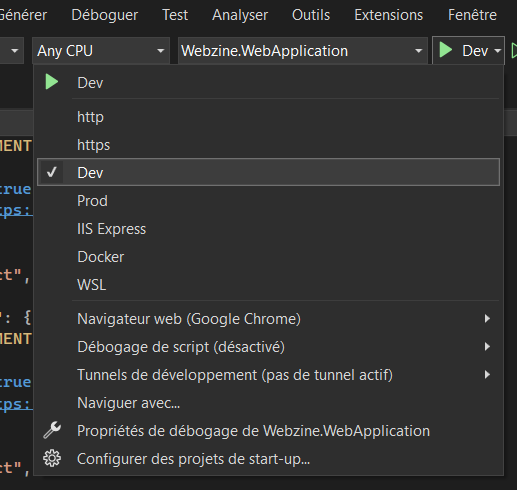
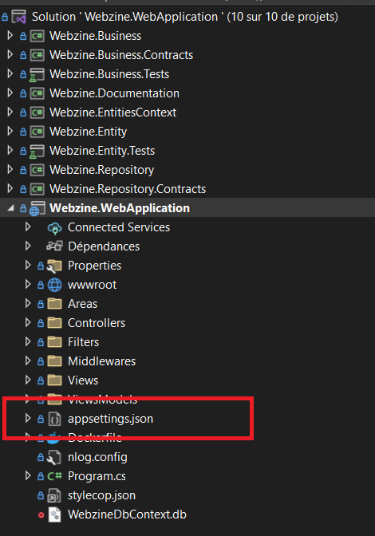
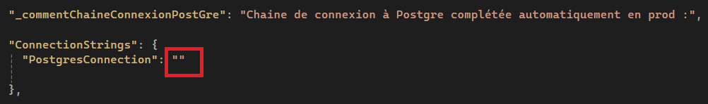

# Documentation de Configuration du Webzine

Dans ce manuel, vous découvrirez les directives indispensables pour paramétrer l'application webzine. 

Il est impératif de respecter scrupuleusement ces instructions afin d'assurer une performance optimale de l'application.
 
# **1. Lancement de l'application**

En fonction de votre système d'exploitation, l'application n'est pas à lancer de la même façon.

## 1.1. Lancement avec Windows 

Pour lancer l'application sur Windows, la commande ci-dessous doit-être lancée dans un terminal (de préférence en recherchant ce dernier dans le menu démarer) :

dotnet publish --configuration Release -r win-x64 Webzine.WebApplication.csproj

Il faut ensuite se positionner dans le dossier :
WebZine\Webzine.WebApplication\bin\Release\net8.0\win-x64\publish

Ouvrir un terminal en clickant sur le chemin du fichier en haut et en tapant "cmd" et faire la commande :

dotnet .\Webzine.WebApplication.dll

notez que faire copier/coller avec Ctrl + C/V ne marche pas sur un terminal et que vous devrez taper au clavier

L'application va se lancer.

## 1.2. Lancement avec Linux 

Pour lancer l'application sur Linux, la commande ci-dessous doit-être lancée dans un terminal :

dotnet publish --configuration Release -r linux-x64 Webzine.WebApplication.csproj

Il faut ensuite se positionner dans le dossier :
WebZine\Webzine.WebApplication\bin\Release\net8.0\linux-x64\publish

Ouvrir un terminal et faire la commande :

dotnet .\Webzine.WebApplication.dll

L'application va se lancer.

# **2. Démarrage de l'application**

Dans le fichier "launchSettings.json" nous avons précisé deux configurations distinctes.

Il nous est possible à tout moment de passer d'un environnement à l'autre.

## 2.1. Environnements de développement

Nous pouvons ainsi démarrer l'application dans un environnement de Développement.

Cet environnement permet d'effectuer des tests et des modifications durant l'application sans compromètre le fonctionnement de l'environnement du client.

Il sera lancé avec une base de données (BDD) SQLite.

SQLite est un système de gestion de base de données relationnelle (SGBDR) qui offre une solution légère, autonome et rapide pour le stockage et la gestion de données. 

Cette BDD est supprimée et recrée à chaque lancement de l'application, permettant ainsi de tester les ajouts, suppressions, éditions des tous les éléments sans craindre de nuire aux données existantes.

Pour lancer l'environnement de développement, vous pouvez vous rendre sur Visual Studio, cliquer sur la flèche verte, et sélectionner "Dev".

## 2.2. Environnements de production

Nous pouvons ainsi démarrer l'application dans un environnement de Production.

Cet environnement sera celui sur laquelle l'utilisateur utilisera l'application.

Il sera lancé avec une base de données PostgreSQL.

PostgreSQL est un SGBDR open source, également connu sous le nom de "Postgres". Il est réputé pour sa fiabilité, sa robustesse, sa conformité aux normes et ses fonctionnalités avancées. 

Au contraire de l'environnement de Développement, la BDD n'est pas supprimée à chaque lancement de l'application.
La BDD est crée est seedée une seule et unique fois.

Ainsi, chaque élément ajouté, supprimé ou édité l'est définitvement.

Cet environnement peut être en quelque sorte émulé par un développeur grâce à la configuration indiquée plus haut dans le fichier "launchSettings.json".

L'environnement de Production peut ainsi être testé.

Pour lancer l'environnement de développement, vous pouvez vous rendre sur Visual Studio, cliquer sur la flèche verte, et sélectionner "Prod".

# **3. Configuration de la BDD Utilisée**

## 3.1. Connexion à la BDD SQLite

Un environnement Développement fonctionne avec SQLite.

Il n'est pas nécessaire de fournir une chaîne de connexion pour créer, seeder et utiliser une BDD SQLite.

Vous n'avez donc aucune configuration à faire.

Seul le choix de démarrer avec un environnement de Développement permettra de lancer l'application avec une BDD SQLite.

## 3.2. Connexion à la BDD PostgreSQL

Un environnement Production fonctionne avec PostgreSQL.

Il est nécessaire de fournir une chaîne de connexion pour pouvoir s'y connectée et ainsi intéragir avec la base de données.

Côté client et utilisateur, une chaîne de connexion est automatiquement ajoutée dans les pipelines afin que le client puisse se connecter à la BDD PostgreSQL mise en place par les administrateurs réseaux.

Côté développeur, il faudra indiquer votre propre chaîne de connexion à votre BDD PostgreSQL.

Pour cela :

- Ouvrez le fichier "appsettings.json" situé dans le dossier "Webzine.WebApplication" de l'application :

- Compléter avec votre chaîne de connexion à cet endroit :

Votre chaîne doit être sous la forme :
**"Host=Adresse_IP;Port=Port;Database=Nom_Base_Données;Username=Nom_Utilisateur;Password=Mot_De_Passe;"**

- `Host` : Adresse IP du serveur de base de données (ou localhost si la base de données est installée localement).
- `Port` : Port de connexion à la base de données (5432 par défaut pour PostgreSQL).
- `Database` : Nom de la base de données.
- `Username` : Nom d'utilisateur de la base de données.
- `Password` : Mot de passe de la base de données.

# **4. Configuration de la provenance des données**

Il est possible de définir où les repositories doivent aller chercher leurs données.

## 4.1. Fausses données

Automatiquement, les BDD se lancent et se seedent avec des fausses données.

Ce paramètre est indiqué dans le fichier **"appsettings.json"** :

## 4.2. Données provenant de Spotify

Il est possible de seeder les BDD avec des données provenant de Spotify.

Pour cela, il faut changer le paramètre indiqué dans le fichier **"appsettings.json"** et y noter "spotify" :

Il faudra également indiquer vos chaînes de connexion Spotify.

- Pour cela, vous devez avoir un compte Spotify, ou le créer directement sur [le site internet](https://www.spotify.com/fr/signup?forward_url=https%3A%2F%2Fopen.spotify.com%2Fintl-fr) :

- Rendez-vous sur le [Dashbord de Spotify](https://developer.spotify.com/dashboard)

- Cliquez sur "Create app"
  
Complétez les informations sur l'application que vous souhaitez créer :

- Cliquez sur "Settings"

- Vous trouverez votre Client Id et votre client secret :

- Intégrer ces chaines dans le fichier **"appsettings.json"** :

# **5. Configuration de la présentation de l'application**

## 5.1. Configurer le nombre de derniers titres chroniqués en page d'accueil

Pour configurer le nombre de derniers titres chroniqués à afficher en page d'accueil, vous pouvez le faire dans le fichier "appsettings.json" situé dans le dossier "Webzine.WebApplication" de l'application :

## 5.2. Configurer le nombre de caractère dans l'extrait du dernier titre chroniqués

Pour configurer la longueur de l'extrait de la chroniqué affiché dans les derniers titres chroniqués, vous pouvez le faire dans le fichier "appsettings.json" situé dans le dossier "Webzine.WebApplication" de l'application :

## 5.2. Configurer le nombre de mois sur lesquels sont calculés les 3 titres les plus populaires

Pour configurer le nombre de mois sur lesquels sont calculés les 3 titres les plus populaires, vous pouvez le faire dans le fichier "appsettings.json" situé dans le dossier "Webzine.WebApplication" de l'application :

