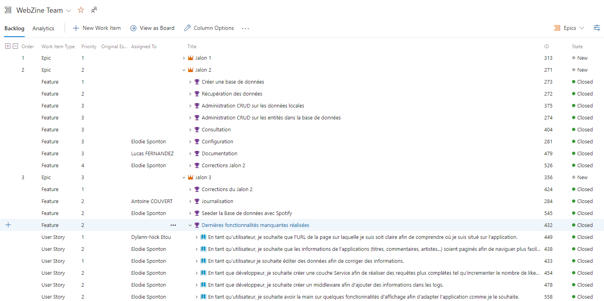
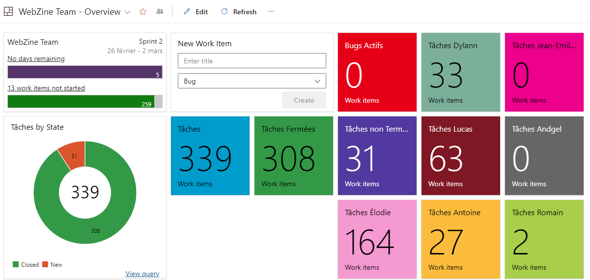
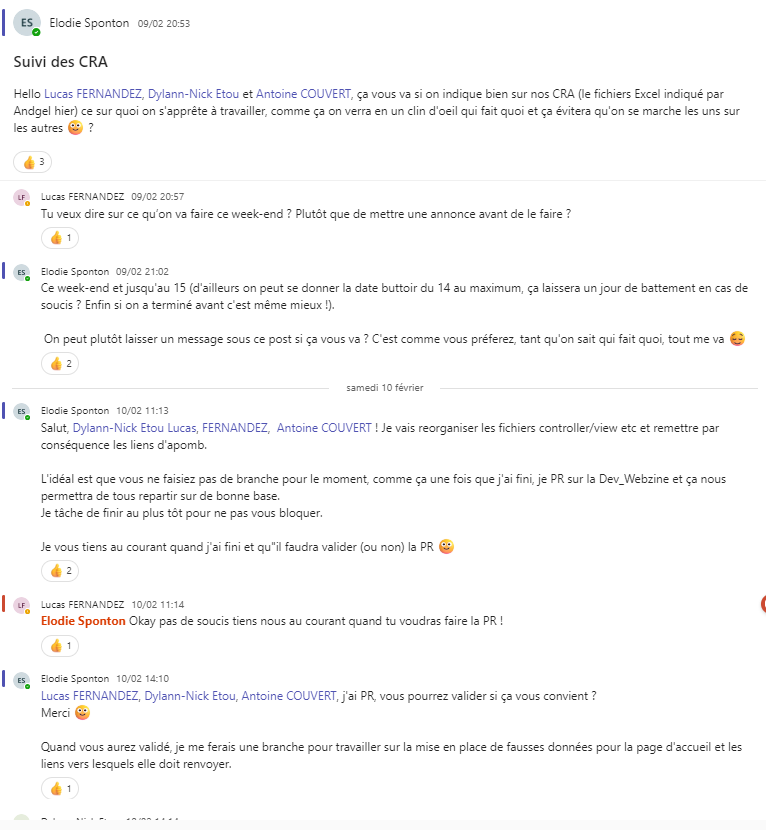

# **2. ORGANISATION DE L'EQUIPE DE DEVELOPPEURS** ##

## 2.1. Reflexion commune pour commencer la création de l'application

Afin de débuter sur la même base et d'être tous en accord, nous avons travailler ensemble sur la création du model de données :

Une fois établie, il nous a permis d'identifier les entités à créer pour notre application ainsi que les données nécessaires à chacune pour que l'application finale fonctionne correctement avec tous les éléments nécessaires.

| FONCTIONNALITES																| TEMPS PASSE |
|-------------------------------------------------------------------------------|:-----------:|
| Mise en place du projet Azure avec Epic, Feature, UserStory et Task			|     1h30    |
|Création du projet sur Visual Studio avec installation des nuggets nécessaires |     1h00    |
| Répartition de la création des fausses données								|     0h15    |

 

## 2.1. Répartition des tâches

### 2.2.1. Répartition au sein de l'équipe 

Vous pouvez retrouver nos [Comptes Rendus d'Activité](https://groupesbtest.sharepoint.com/:x:/s/DIIAGE2026DI1P4/EY5e9Z9cSJlNhY6EC677OKkBNBYJHpZv8_6OMtE7qLdtiQ?e=SJ8cjc&wdOrigin=TEAMS-MAGLEV.teams_ns.rwc&wdExp=TEAMS-TREATMENT&wdhostclicktime=1708886671961&web=1) pour un détail précis du travail effectué.

### 2.2.2. Lucas FERNANDEZ
| TÂCHES												| TEMPS PASSE |
|-------------------------------------------------------|:-----------:|
| Mise en place du backlog AzureDevops					|    0h15     |
| Mise en place des User Stories sur AzureDevops		|    1h00     |
| Création des fausses données pour l'entité Artiste	|    4h00     |
| Création de l'entité Artiste							|    1h00     |
| Création de la page Artiste							|    2h00     |
| Création de la page Dashboard							|    1h30     |
| Création du Dashboard	Azure DevOps					|    1h30     |
| Correction et assignation des tâches Azure DevOps		|    1h00     |
| Rédaction de la documentation							|    3h00     |

### 2.2.3. Dylann-Nick ETOU

| TÂCHES												| TEMPS PASSE |
|-------------------------------------------------------|:-----------:|
| Création du layout									|             |
| Création de la navbar									|             |
| Création de la liste des styles à droite des pages    |             |
| Création du footer									|             |

### 2.2.4. Antoine COUVERT

| JALON 1																										| TEMPS PASSE |
|---------------------------------------------------------------------------------------------------------------|:-----------:|
| Création de la page Contact et de ses données																	|     3h15    |
| Test de l'application et listing des bugs et des points ne correspondant pas exactement à la demande client   |     2h30    |
| Création des fausses données pour l'entité Style																|     4h00    | 
| Création de l'entité Style																					|     1h00    |

| JALON 2																										| TEMPS PASSE |
|---------------------------------------------------------------------------------------------------------------|:-----------:|
| Mise en place du Webzine.EntitiesContext																		|     3h00    |
| Complétion des controllers et correction des bugs																|     2h30    |
| Correction de bugs																							|     4h00    |

| JALON 3																										| TEMPS PASSE |
|---------------------------------------------------------------------------------------------------------------|:-----------:|
| Review de la documentaion																						|     1h30    |
| Logs et Filtres																								|     5h00    |
| Début de la couche Service																					|     4h00    |
| Code Review																				|     5h00    |

### 2.2.5. Elodie SPONTON

| TÂCHES JALON 1																						| TEMPS PASSE |
|-----------------------------------------------------------------------------------------------|:-----------:|
| Création des fausses données pour l'entité Titre												|    4h00     |
| Création des fausses données pour l'entité Commentaire										|    1h00     |
| Création des fausses données pour l'entité Style												|    1h00     |
| Création des fausses données pour l'entité Artiste											|    4h00     |
| Création de l'entité Titre																	|    1h00     |
| Création de la page Titre																		|    6h00     |
| Création de la page Recherche																	|    0h30     | 
| Création de la page API Version																|    0h10     |
| Création des pages administration (CRUD) des commentaires										|    2h00     |
| Création des pages administration (CRUD)  des titres											|    8h00     |
| Création des pages administration (CRUD)  des styles											|    3h00     | 
| Création des pages administration (CRUD)  des commentaires									|    2h30     |
| Création des pages administration (CRUD)  des artistes										|    3h00     |
| Mise en place des fausses données pour l'ensemble de l'application dans un fichier commun     |    11h00    |
| Création d'un View Component et d'une View Partial pour la colonne à droite de l'application  |    3h30     | 
| Mise au propre du code																		|    7h00     |

 

| TÂCHES JALON 2																								| TEMPS PASSE |
|---------------------------------------------------------------------------------------------------------------|:-----------:|
| Corrections Jalon 1																							|    7h00     |
| Création de la BDD avec SQLite et la seeder avec les fausses données											|    4h00     |
| Mise en place des Repositories pour les Titres																|    3h00     |
| Ajout de certaines fonctionnalités qui n'étaient pas présentes dans l'application ou qui fonctionnaient mal	|    12h00    |
| Entité Style : Mise en place de la validation du formulaire de création d'un style							|    1h15     |
| Entité Artiste : Mise en place de la validation du formulaire de création d'un artiste 						|    0h15     |
| Entité Commentaire : Mise en place de la validation du formulaire de création d'un commentaire 				|    1h30     |
| Entité Titre : Mise en place de la validation du formulaire de création d'un titre 							|    1h00     |
| Entité Style : Mise en place de la validation du formulaire de l'édition d'un style 							|    00h45    |
| Correction de la création de la BDD																			|    1h00     |

 

| TÂCHES JALON 3																					| TEMPS PASSE |
|---------------------------------------------------------------------------------------------------|:-----------:|
| Seeder la BDD avec les données de Spotify															|    19h00    |
| Pagination des pages Accueil, Liste des titres, Listes des commentaires et Liste des artistes		|    4h30     |
| Implémenter l'incrémentation des vues		|    1h00     |
| Implémenter l'incrémentation des likes		|    00h30     |
| Mise en place du DashboardService		|    1h00     |
| Mise en place de tests pour le DashboardService		|    4h00     |
| Correction des routes		|    7h30     |
| Création et mide en place d'un middleware	|    1h30     |
| Mise en place dans le Program.cs de conditions pour être sur SQLite dans l'environnement de dev et en PostgreSQL en environnement de prod	|    4h00     |
| Code review |    17h00     |
| Mise en place des pages 404 |    2h30     |
| Correction du responsive design |    4h00     |
| Test de toute l'application et correction des bugs |    3h00     |

## 2.2. Fonctionnement de l'équipe

Nous avons commencé en nous répartissant les tâches équitablement dans l'équipe puis avons décidé, pour faire avancer le projet au maximum, que dès que l'un de nous terminait sa tâche il travaillerait sur une nouvelle en informant les autres membres de l'équipe au préalable.

## 2.3. Intéraction entres les membres

## 2.3.1. Utilisation de AzureDevOps

L'organisation des tâches et des fichiers a été réalisée à travers AzureDevOps, nous permettant une gestion efficace du projet.

Nous avons construit ensemble le squelette de l'application, en mettant en commun nos points de vue et méthodes. 

Notre Azure DevOps fonctionne ainsi :

- Un **Epic** représente un **Jalon**,
- Une **User Story (US)** représente un ensemble de fonctionnalités attendues par un utilisateur, par le client ou par un développeur,
- Les **tâches** représentent ce qui doit être réalisé pour accomplir l'US.

Vous trouverez ci-dessous un extrait de notre Azure DevOps :

Nous avons également mis en place un Dashboard afin de voir la répartition des tâches dans l'équipe :

 

Si l'accès vous est autorisé, vous pouvez retrouver notre [Compte Azure](https://dev.azure.com/Diiage2026Andgel/WebZine/_backlogs/backlog/WebZine%20Team/Epics) pour un détail précis du travail effectué.

Une fois cela accompli, nous nous sommes répartis les Users Stories, en débutant par les plus cruciales pour assurer une progression rapide.

Nous avons établis ensemble que l'ordre de priorité s'échelone de 1 pour les tâches/US à réaliser en priorité à 4 pour les tâches/US moins cruciales.

## 2.3.2. Code review

Après l'achèvement de chaque tâche individuelle, nous avons organisé des sessions de pull requests. Celles-ci ont permises de résoudre les conflits éventuels en équipe. 

Une fois tous les codes fusionnés sur la branche principale, nous avons réitéré le processus en nous répartissant de nouvelles tâches pour maintenir un flux de travail continu.

## 2.3.3. Discussions Teams

En dehors des périodes d'école, il nous est difficile de nous rendre disponible aux mêmes moments.

Nous avons utilisé les conversations Teams de notre Equipe pour se faire part de notre avancée et demander des calls si nécessaire.

Vous trouverez ci-dessous un extrait d'une de nos conversions pour finir le Jalon 1 :

