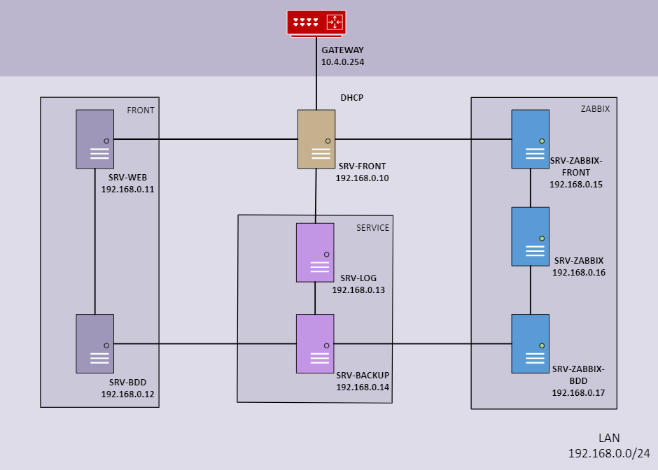

# **3. ORGANISATION DES OPS** ##

Les ops ont notamment mis en place les différents serveurs nécessaires au projet : 

* Le serveur Web de l'application,

* Le SRV-Front, serveur NGinx permettant la redirection pour faire fonctionner l'application,

* Le SRV-ZABBIX-FRONT pour superviser les serveur

Vous pouvez retrouver plus d'informations et de détails dans leur propre documentation.