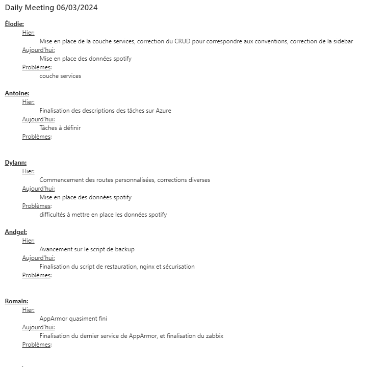
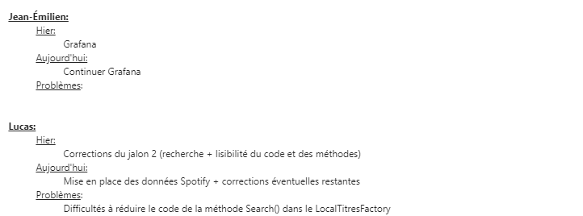
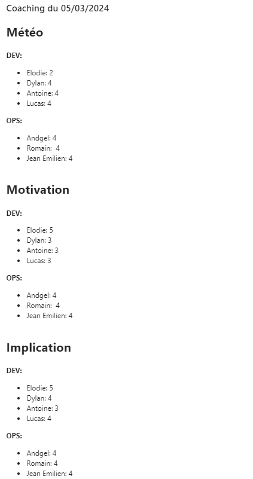
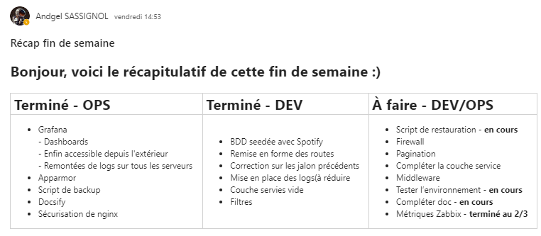
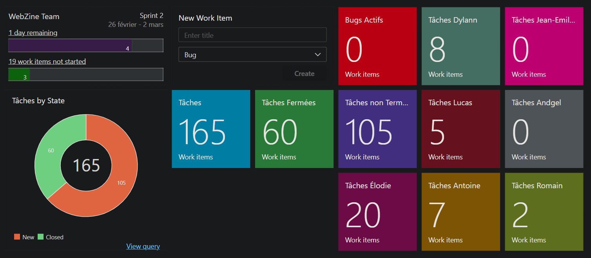
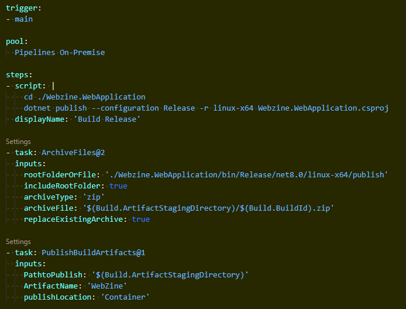

# **4. ORGANISATION DE LA COLLABORATION DEVELOPPEURS/ADMINISTRATION RESEAUX** ##

## 4.1. Suivi de l'avancement de chaque équipe

### 4.1.1. Comptes rendus d'activité

Chaque jour, à la fin de la journée de travail, nous avons pris le temps de mettre à jour nos comptes rendus d'activité. Cette pratique régulière nous a permis de suivre efficacement l'avancement individuel et collectif du projet.

### 4.1.2. Daily meetings

Chaque matin, nous avons organisé des réunions d'une dizaine de minutes. 

Durant ces sessions, tous les membres du groupe ont eu l'opportunité de partager leurs accomplissements de la veille, leurs objectifs pour la journée en cours, ainsi que les difficultés rencontrées. 

Cette communication quotidienne a renforcé la cohésion de l'équipe et a été cruciale pour anticiper et résoudre rapidement les éventuels obstacles.

Tout comme pour la collaboration dev/ops, les daily meetings nous ont permis de connaître régulièrement l'avancée individuel de chacun et par conséquent de l'application en général.

Vous trouverez ci-dessous un extrait du Daily meeting du 06/03/2014 :

Vous pouvez retrouver l'ensemble de nos Daily Meeting dans notre Groupe "Equipe 4", le Teams du projet.

### 4.1.3. Coaching

Afin de nous assurer de la motivation de tous les membres de l'équipe et pour prévenir les baisses de motivations ou encore les problèmes psychologiques par rapport à ce projet nous avons mis en place des réunions météo d'équipe.

Ces réunions permettent à chacun d'exprimer honnêtement ses ressentis sur le projet et l'équipe en y indiquant son niveau de motivation et son implication ressentie dans le projet.

En plus de tout cela ces réunions nous permettent d'améliorer continuellement la façon de faire et l'accompagnement des membres du groupe en fonction de leurs besoins.

Les points évalués sont :
- Humeur générale,
- Motivation,
- Implication,
- Confiance en l'équipe,
- Confiance dans le projet,
- Autonomie,
- Travail d'équipe,
- Intéraction avec les intervenants.

Vous trouverez ci-dessous un extrait du coaching du 05/03/2024 :

Tous comme les Daily Meetings, vous pouvez retrouver ces coaching dans notre Groupe Equipe 4 le Teams du projet.

### 4.1.4. Travail en commun

Lors de certaines tâches les parties Dev et Ops se sont réunies afin de s'entraider dans la production ou/et la mise en place de certains outils. Par exemple, lors de la mise en place des pipelines de déploiement automatiques.

### 4.1.5. Point de fin de semaine

Nous avons réalisé un dernier point le vendredi 08/03/2024, avant de partir chacun de notre côté, afin de mettre à plat les dernière tâches à terminer :

## 4.1.6 Tableau classique

Nous également avons decidé de mettre en place une phase d'explication des avancements de chacun sur un tableau blanc.

Dans ce tableau nous retrouvons ce qui a été fait par chaque partie avec une explication lorsque nécessaire, ainsi que ce qu'il reste à faire,
en détaillant ce qui concerne une partie de l'équipe et ce qui peut être fait en commun.

| OPS														|     DEV												 |     A faire						   |    Travail en commun    |
|-----------------------------------------------------------|:------------------------------------------------------:|:-----------------------------------:|:-----------------------:|
| Métriques Zabbix finies 2/3								| BDD seedée avec les données Spotify           		 | Script de restauration		       |[ ]                      |
| Grafana accessible depuis réseau externe					| Remise en forme des routes        					 | Firewall		           	           |[ ]                      |
| Dashboards Grafana terminés								| Corrections des jalons précédents presque finis        | Pagination		          	       |[ ]                      |
| Remontées de logs sur les serveurs						| Mise en place des logs    							 | Middleware		          	       |[ ]                      |
| AppArmor terminé (Cloisonement et sécurisation des infra)	| Couche de services (vide pour le moment)    			 | Compléter couche services		   |[ ]                      |
| Script de backup terminé									| Filtres    											 | Tester environnements		       |[x]                      |
| Docsify en cours											|														  |Compléter documentation		       |[x]                      |
| Protection de Nginx (blocage accès pas l'extérieur)		|														 |									   |                         |
| Rédaction de la documentation								|														 |									   |                         |

Tableau datant du 08/03/2024

## 4.2. Utilisation d'Azure DevOps

Afin d'améliorer la visibilité et le suivi du travail en continu, nous avons créé un tableau de bord dédié sur Azure DevOps.

Ce tableau de bord centralise les informations relatives aux tâches associées à chaque membre du groupe, offrant ainsi une vue d'ensemble instantanée de l'avancement du projet.

### 4.2.1. Mise à jour quotidienne

Lors de nos réunions quotidiennes, le tableau de bord Azure DevOps est consulté en temps réel pour discuter des progrès, des obstacles éventuels, et pour définir les priorités du jour.

Cette pratique renforce la transparence et assure une meilleure coordination entre les équipes Dev et Ops.

### 4.2.2. Tableau de bord

Le tableau de bord est conçu de manière à être personnalisable en fonction des besoins spécifiques de l'équipe.

Des ajustements réguliers sont effectués pour garantir la pertinence des informations affichées et pour répondre aux évolutions du projet.

Cette intégration d'Azure DevOps dans notre processus quotidien a considérablement amélioré la communication et la collaboration au sein de l'équipe, renforçant ainsi l'efficacité globale du projet.

### 4.2.3. Pipelines

Dans le cadre de cette mise en place nous avons dans un premier temps fait un point sur ce qu'étaient réellement les pipelines et les étapes par lesquelles le déploiement automatique devait passer.
L'équipe Dev a ensuite listé les commandes et étapes à executer afin de déployer l'application pour que l'équipe Ops puisse construire la pipeline.

Voici la liste des commandes nécessaires à la création de l'artefact:

  

- **<u>trigger:</u>** Branche qui déclenchera l'activation de la pipeline lors d'un changement.
- **<u>pool:</u>** Agent à appeler pour exécuter la pipeline.
- **<u>steps:</u>** Liste des différentes étapes à effectuer lors du lancement de la pipeline. 

## 4.2.4. Widgets et indicateurs

Le tableau de bord est composé de divers widgets et indicateurs personnalisés, permettant un suivi détaillé des éléments clés du projet.

Certains widgets incluent :

- **Avancement du sprint actuel:** Affiche l'avancement actuel et le temps restant avant la fin du sprint en cours.

- **Vue d'ensemble des tâches:** Affiche le nombre total de tâches assignées, en cours et terminées.
Cette vue permet de voir la répartition des tâches au sein des deux équipes.

- **Création rapide:** Permet de créer rapidement des "Work Items" directement depuis le dashboard.

- **Avancement face aux bugs:** Affiche le nombre de bugs actifs afin de s'assurer de les régler au plus vite.

