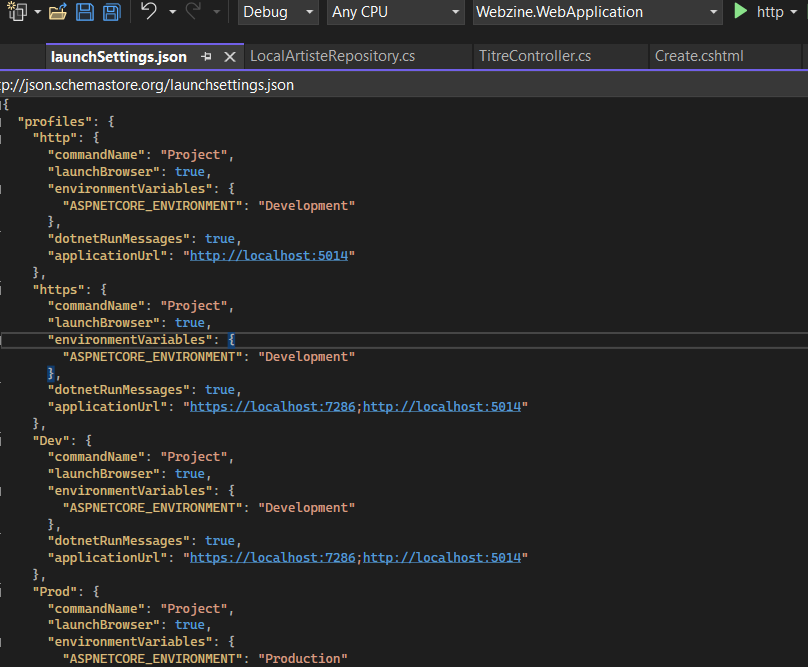

# **7. ANNEXES** ##

## 7.1. Configurer l'application

Tableau des propriété à configurer et leurs valeurs

## 7.2 Environnements de développement

Afin de ne pas déteriorer l'environnement et les données du client lors de nos tests nous avons créé deux environnements distincs.
Un environnement "Développement", servant pour effectuer les tests et les modifications dur l'application sans compromètre le fonctionnement de l'environnement du client,
et un environnement "Production" qui tournera avec les données et les infrastructures du client.

Il nous est possible à tout moment de passer d'un environnement à l'autre.

Dans le fichier "launchSettings.json" nous avons précisé deux configurations distinctes.

Nous retrouvons ces configurations au moment du lancement de l'application:

.png)

## 7.3 Repository Local ou distant

Il est également possible de définir où le repository doit aller chercher ses données.
Il est possible de récupérer les données via une base de données locale ou distante.
Pour cela il suffit de définir le paramètre dans le fichier "<b>appsettings.json</b>"

.png)

Nous avons donc défini les différentes procédures à suivre lors qu'une configuration locale ou distante est choisie dans le fichier "<b>Program.cs</b>"

.png)

.png)
