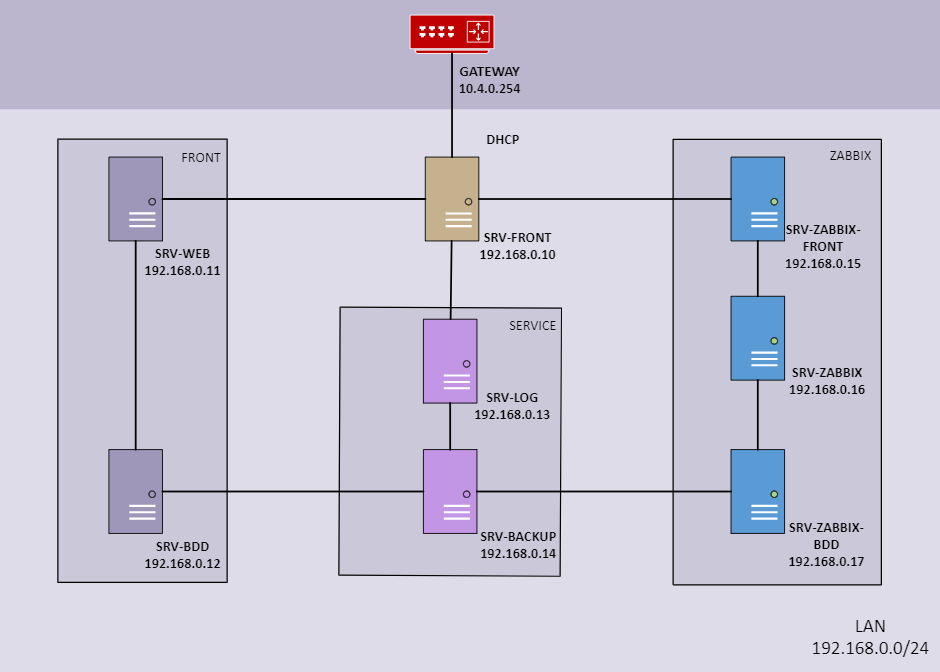

<# Rapport 
 
# **1. Introduction** ##
 
Le projet répond au besoin du client de développer une application web de type Webzine, un magazine publié sous la forme d'un site web.  
L'objectif principal de ce webzine est de présenter des chroniques détaillées sur des artistes musicaux et leurs titres.

Les fonctionnalités clés de l'application incluent la possibilité pour les utilisateurs de consulter les chroniques rédigées par les créateurs des pages, de laisser des avis, et aussi de créer leurs propres pages de revue.  
Ce concept favorise une interaction dynamique entre les amateurs de musique et les contributeurs, créant ainsi une communauté engagée autour de la passion musicale.

Outre la réalisation des objectifs fonctionnels, ce projet vise à renforcer la cohésion entre les équipes de développement (Devs) et les opérations (OPS).   
La collaboration étroite entre ces deux domaines est essentielle pour garantir le bon fonctionnement, la performance et la maintenance de l'application web.

## 1.1 Technologies utilisées :

Les technologies sélectionnées pour la réalisation de ce projet sont spécifiées selon les besoins des équipes :

### 1.1.1 Côté DEV :

Utilisation de C# et ASP.NET Core 8.0 pour la mise en place robuste et efficace du backend de l'application.

### 1.1.2 Côté OPS :

Supervision des serveurs assurée par Zabbix, assurant ainsi une gestion proactive de l'infrastructure et une réponse rapide aux éventuels problèmes de performance.

## 1.2 L'équipe :

Notre équipe de projet est composée de 4 développeurs :

- Elodie Sponton

- Dylann-Nick Etou

- Antoine Couvert

- Lucas Fernandez

et 3 adminitrateurs réseaux :

- Jean-Emilien Viard

- Andgel Sassignol

- Romain Vidotto

Notre équipe est sous la responsabilité de M.Sassignol, désigné chef de projet.

La suite du rapport détaille l’organisation au sein de l’équipe qu’il s’agisse de la partie DEV ou OPS.  
Il passera en revue la cohésion que nous avons mis en place afin de nous tenir informés des réalisations de chacun avant de revenir sur les problèmes rencontrés tout au long de ce projet.

# **2. Organisation de la collaboration dev/ops**

## 2.1 Utilisation de AzureDevOps

L'organisation des tâches et des fichiers a été réalisée à travers AzureDevOps, nous permettant une gestion efficace du projet.

Nous avons construit ensemble le squelette de l'application, en mettant en commun nos points de vue et méthodes. 

Une fois cela accompli, nous nous sommes répartis les Users Stories, en débutant par les plus cruciales pour assurer une progression harmonieuse.

## 2.2 Code review

Après l'achèvement de chaque tâche individuelle, nous avons organisé des sessions de pull requests. Celles-ci ont permises de résoudre les conflits éventuels en équipe. 

Une fois tous les codes fusionnés sur la branche principale, nous avons réitéré le processus en nous répartissant de nouvelles tâches pour maintenir un flux de travail continu.

## 2.3 Comptes rendus d'activité

Chaque jour, à la fin de la journée de travail, nous avons pris le temps de mettre à jour nos comptes rendus d'activité. Cette pratique régulière nous a permis de suivre efficacement l'avancement individuel et collectif du projet.

## 2.4 Daily meetings

Chaque matin, nous avons organisé des réunions rapides, ne dépassant pas une dizaine de minutes. 

Durant ces sessions, tous les membres du groupe ont eu l'opportunité de partager leurs accomplissements de la veille, leurs objectifs pour la journée en cours, ainsi que les difficultés rencontrées. 

Cette communication quotidienne a renforcé la cohésion d'équipe et a été cruciale pour anticiper et résoudre rapidement les éventuels obstacles.

## 2.4 Discussions Teams

En dehors des périodes d'école, il nous est difficile de nous rendre disponible aux mêmes moment.

Nous avons utiliser les conversations Teams de notre Equipe pour se faire part de notre moindre avancée et demander des calls si nécessaires.

# **3. Organisation de l'équipe dev**

## 3.1 Reflexion commune pour commencer la création de l'application

Afin de débuter sur la même base et d'être tous en accord, nous avons travailler ensemble sur la création du model de données :

Une fois établie, il nous a permis d'identifier les entités à créer pour notre application ainsi que les données nécessaires à chacune pour que l'application finale fonctionne correctement avec tous les éléments nécessaires.

## 3.2 Répartition des tâches coté DEV

**Antoine** : 

Antoine s’est chargé de la création de la page "Contact" ainsi que la création et l’affichage des données qui la compose. 

Après cela il s’est occupé à plusieurs reprises de tester et lister les bugs potentiels sur l'application ainsi que les points ne correspondant pas exactement à la demande client.

**Elodie** : 

Elodie s’est chargée de la création des pages de titres et de celle permettant la gestion des commentaires ainsi que la création des données qui sont ensuite venues nourrir ces pages. 

Elle a ensuite réalisé la fonction de recherche qui permet d’afficher le texte recherché au sein des artistes et des titres.

A la suite de cela elle s’est occupée de corriger certains aspects qui ne correspondaient pas aux résultats attendus notamment sur le plan de l’affichage

**Dylann** : 

Dylann lui s’est occupé de concevoir le layout qui est présent sur toutes les pages, comportant une en-tête avec des boutons de navigation, une liste de styles verticale sur la droite de la page et un footer comprenant des informations sur l’application.

**Lucas** : 

Lucas s’est occupé de la création de la page permettant d’afficher les informations d’un artiste ainsi que de créer les données alimentant cette dernière. 

Suite à cela et grâce a une intervention sur la mise en place des Users Stories au sein d’un projet. 

Il a refaçonné le backlog de notre AzureDevOps pour une meilleure organisation du groupe. 

Pour finir il s’est occupé de la rédaction de la documentation.

# **4. Organisation des ops**

Les ops ont commencé à mettre en place les différents serveurs nécessaires au projet : 

-Le serveur Web de l'application,

-Le SRV-Front, serveur NGinx permettant la redirection pour faire fonctionner l'applicatoin,

-Le SRV-ZABBIX-FRONT pour supperviser les serveur

# **5. Conclusion - Jalon 1**

Notre projet avait pour objectif la création d'une application web de type Webzine, offrant une plateforme dynamique pour les chroniques musicales et favorisant l'interaction communautaire.

Nous avons mis en place des méthodes rigoureuses d'organisation, notamment l'utilisation d'AzureDevOps pour la gestion des tâches et le suivi des Users Stories. 

Les réunions quotidiennes ont renforcé la cohésion d'équipe, permettant à chaque membre de partager ses avancées, objectifs, et de surmonter les éventuels obstacles ensemble.

Bien que nous ayons rencontré des défis, notre collaboration proactive et l'esprit d'entraide ont été déterminants pour surmonter ces obstacles. 

Les sessions de code review et les réunions régulières ont créé un environnement propice à l'apprentissage mutuel et au partage d'expertise.

Au-delà des lignes de code et des fonctionnalités implémentées, ce projet nous a apporté une expérience enrichissante sur la coordination d'équipes, la résolution de problèmes en groupe, et le développement d'une application web robuste. 

Ces apprentissages constituent des atouts précieux pour nos futures collaborations et projets. 

En somme, le succès de ce projet ne se mesure pas seulement aux fonctionnalités déployées, mais aussi à la croissance individuelle et collective que nous avons réalisée au cours de ce parcours.